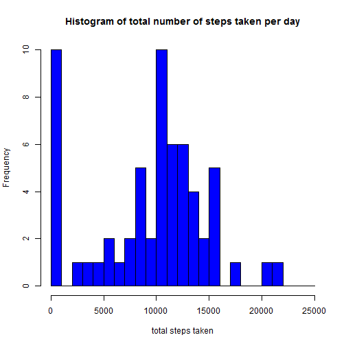
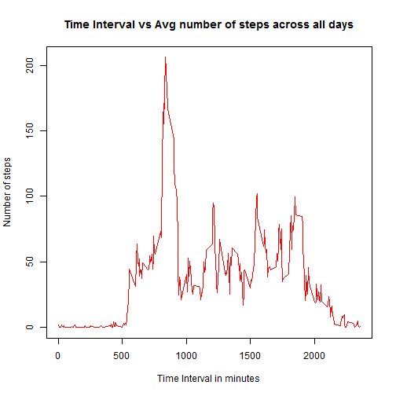
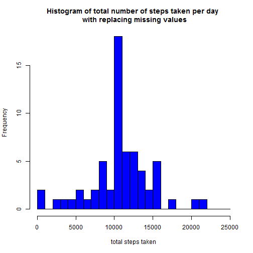
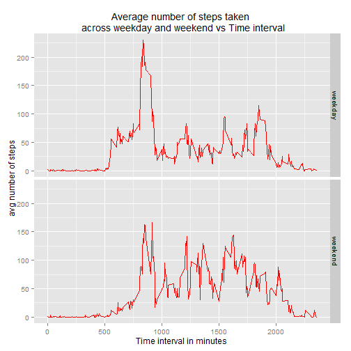

Analysis of data from a personal monoitoring device of an individual
=============================================================
First, I read the given dataset into a dataframe using *read.csv()*.  
The dataset has 3 variables.  
1.steps: Measure the number of steps taken in a 5 minute interval.  
2.Date  
3.interval:identifies the interval in which data is measured

## Loading and preprocessing the data


```r
if(!file.exists("C:/Data/DataScience/RepData_PeerAssessment1/activity.csv"))
 stop("File not exists in the working directory") 
activity<-data.frame(read.csv(file="C:/Data/DataScience/RepData_PeerAssessment1/activity.csv",stringsAsFactors=FALSE,header=TRUE))
```


Now convert the date column into appropriate date format


```r
activity$date<-as.Date(activity$date)
```

## What is mean total number of steps taken per day?

Now calculate the total number of steps taken per day, using *tapply*.
Then make a histogram of it. In the histogram, I have defined the breaks to be 
of 1000 interval each.


```r
x<-tapply(activity$steps,activity$date,sum,na.rm=TRUE)
total_steps_pd<-data.frame(Date=names(x),count=x,row.names = NULL)
hist(total_steps_pd$count,breaks=seq(from=0,to=25000,by=1000),xlab="total steps taken",col = "blue",main="Histogram of total number of steps taken per day")
```

 

Here I am using Inline text to report the mean and median values.


```r
mean_steps<-mean(total_steps_pd$count)
median_steps<-median(total_steps_pd$count)
```
The results of mean and median as follows.  
The mean of total number of steps taken per day is **9354.2295082**.  
The median of total number of steps taken per day is **10395**.  
  

## What is the average daily activity pattern?
Calculate the avg steps, averaged  across all the days, for each interval. I am using *tapply* to establish this.


```r
y<-tapply(activity$steps,activity$interval,mean,na.rm=TRUE)
Interval<-as.numeric(names(y))
row.names(y)<-NULL
avg_steps<-data.frame(Interval=Interval,count=y,row.names = NULL)
```


Plot the Time interval and the average number of steps taken across all days


```r
plot(x=avg_steps$Interval,y=avg_steps$count,type="l",xlab="Time Interval in minutes",ylab="Number of steps",col="red")
title("Time Interval vs Avg number of steps across all days")
```

 

Find which interval has maximum average number of days

```r
max_value<-which(avg_steps$count==max(avg_steps$count))
interval<-avg_steps[max_value,1]
max(avg_steps$count)
```

[1] 206.1698

```r
interval
```

[1] 835
  
  The 5-minute interval , which contains the maximum number of steps on average across all the days is **835**. 


## Imputing missing values

Now calculate the total number of missing values in the dataset
  

```r
count<-sum(is.na(activity))
```

The number of rows with missing values in the dataset is **2304.  
To replace the missing values in the dataset, I am using the mean for that 5 minute interval.I created a new dataset *new_activity*.


```r
  new_activity<-data.frame(interval=numeric(nrow(activity)),steps=numeric(nrow(activity)))
  

for(i in 1:nrow(activity))
{
  if(!is.na(activity$steps[i]))
  {
    new_activity$steps[i]<-activity$steps[i]
    new_activity$interval[i]<-activity$interval[i]
    
  }
  else
  {
   interval<-activity$interval[i]
   replace_val<-round(avg_steps[which(avg_steps$Interval==interval),2])
   new_activity$steps[i]<-replace_val
    new_activity$interval[i]<-activity$interval[i]
  }
  
  
}
new_activity<-cbind(activity$date,new_activity)
colnames(new_activity)<-c("Date","interval","steps")
```


Now plotting the histogram of the average number of steps taken per day from the new dataset.


```r
z<-tapply(new_activity$steps,new_activity$Date,sum,na.rm=TRUE)
total_steps_new<-data.frame(Date=names(z),count=z,row.names = NULL)
hist(total_steps_new$count,breaks=seq(from=0,to=25000,by=1000),xlab="total steps taken",col = "blue",main="Histogram of total number of steps taken per day \n with replacing missing values")
```

 

```r
mean_new<-mean(total_steps_new$count)
median_new<-median(total_steps_new$count)
mean_new
```

[1] 10765.64

```r
median_new
```

[1] 10762

   The results of new values of mean and median as follows.  
The mean of total number of steps taken per day is **1.0765639 &times; 10<sup>4</sup>**.  
The median of total number of steps taken per day is **1.0762 &times; 10<sup>4</sup>**. 
  
  
As a result of replacing missing values , **the new median and mean values have incresed than the older values**.Thus the missing values introduce a bias in our analysis. The new distribution is more evened out to form an approximate bell curve.    


## Are there differences in activity patterns between weekdays and weekends?
Create a new categorical variable with 2 levels *weekend* and *weekday*.  


```r
new_activity$day<-ifelse(weekdays(new_activity$Date)=="Saturday"|weekdays(new_activity$Date)=="Sunday","weekend","weekday")
new_activity$day<-as.factor(new_activity$day)
```

Using the *ddply function in the plyr package* we split the data into weekdays and weekends and then take the avg of steps across the days for each interval.


```r
library(plyr)
split_data<-ddply(new_activity,.(day,interval),summarise,mean=mean(steps))
```
The plot code using ggplot2


```r
library(ggplot2)
g<-ggplot(data=split_data,aes(interval,mean))
plot<-g+geom_line(color="red")+facet_grid(day~.)
plot<-plot+labs(x="Time interval in minutes",y="avg number of steps",title="Average number of steps taken \n across weekday and weekend vs Time interval")
print(plot)
```

 
